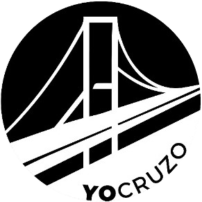

# Yo Cruzo - Puente en Conexión

<p align="center">
  
</p>

## 🌉 Descripción del Proyecto

**Yo Cruzo** es una aplicación móvil diseñada específicamente para facilitar el transporte compartido entre las ciudades de Resistencia (Chaco) y Corrientes (Corrientes), separadas por el puente General Manuel Belgrano. La plataforma permite a conductores publicar sus viajes planificados y a pasajeros unirse a estos viajes, compartiendo gastos y reduciendo el impacto ambiental.

El nombre "Yo Cruzo" hace referencia al acto de cruzar el puente que conecta estas dos ciudades, una actividad cotidiana para muchos habitantes de la región.

## 🚀 Características Principales

### Para Pasajeros

- Búsqueda de viajes por destino, fecha y hora
- Reserva de asientos en viajes disponibles
- Sistema de chat en tiempo real con conductores
- Notificaciones push para actualizaciones de viajes
- Historial de viajes y reservas

### Para Conductores

- Publicación de viajes con detalles de ruta, hora y asientos disponibles
- Gestión de solicitudes de pasajeros
- Administración de vehículos personales
- Sistema de valoraciones y reseñas

## 💻 Tecnologías Utilizadas

### Frontend

- **React Native**: Framework principal para desarrollo cross-platform
- **Expo**: Plataforma para agilizar el desarrollo de aplicaciones React Native
- **Redux**: Gestión del estado global de la aplicación
- **React Navigation**: Sistema de navegación (Drawer y Stack)
- **React Hook Form**: Manejo y validación de formularios
- **Socket.IO Client**: Comunicación en tiempo real para chat
- **Dayjs**: Manipulación de fechas y horas

### Backend e Infraestructura

- **Firebase**:
  - Autenticación de usuarios
  - Cloud Storage para almacenamiento de imágenes
- **Expo Notifications**: Sistema de notificaciones push
- **Google Maps API**: Geolocalización y búsqueda de direcciones
- **Hermes JS Engine**: Motor JavaScript optimizado para React Native

## 📱 Capturas de Pantalla

[Aquí irían capturas de pantalla de la aplicación]

## 🧩 Estructura del Proyecto

```
yo-cruzo-client/
├── assets/                # Recursos estáticos (imágenes, fuentes)
├── src/
│   ├── components/        # Componentes de la aplicación
│   │   ├── Commons/       # Componentes comunes reutilizables
│   │   ├── Controls/      # Componentes de control (DatePicker, etc.)
│   │   ├── Chat/          # Componentes relacionados con el chat
│   │   ├── Profile/       # Componentes del perfil de usuario
│   │   ├── SearchTrips/   # Componentes de búsqueda de viajes
│   │   ├── Trips/         # Componentes de gestión de viajes
│   ├── constants/         # Constantes de la aplicación
│   ├── helpers/           # Funciones auxiliares
│   ├── hooks/             # Hooks personalizados
│   ├── navigations/       # Configuración de navegación
│   ├── redux/             # Estado global con Redux
│   │   ├── actions/       # Acciones de Redux
│   │   ├── reducers/      # Reducers de Redux
│   ├── services/          # Servicios de API, notificaciones, etc.
```

## 🔄 Flujo de Trabajo Principal

### Pasajeros

1. El usuario inicia sesión o se registra
2. Selecciona rol "Pasajero" en el menú lateral
3. Busca viajes en la pantalla principal (SearchTripPage)
4. Visualiza los resultados de la búsqueda
5. Selecciona un viaje y solicita unirse
6. Chatea con el conductor para coordinar detalles

### Conductores

1. El usuario inicia sesión o se registra
2. Selecciona rol "Conductor" en el menú lateral
3. Crea un nuevo viaje o gestiona los existentes
4. Acepta o rechaza solicitudes de pasajeros
5. Coordina detalles a través del chat integrado

## 📋 Modelos Principales

### Usuario

- Información personal (nombre, email, teléfono)
- Sistema de roles (conductor/pasajero)
- Calificaciones y reseñas
- Historial de viajes

### Viaje

- Origen y destino
- Fecha y hora de partida
- Asientos disponibles
- Precio por asiento
- Estado (pendiente, en proceso, completado)

### Vehículo

- Información del auto (modelo, color, matrícula)
- Capacidad de pasajeros

## ⚙️ Instalación y Configuración

```bash
# Clonar el repositorio
git clone https://github.com/tu-usuario/yo-cruzo-client.git

# Instalar dependencias
cd yo-cruzo-client
npm install

# Configurar variables de entorno
# (Crear archivo .env basado en .env.example)

# Iniciar en modo desarrollo
npm start
```

### Requisitos

- Node.js 14+
- Expo CLI
- Cuenta de Firebase
- API Key de Google Maps

## 🚧 Estado del Proyecto

La aplicación se encuentra actualmente en versión 1.0.8, disponible en Google Play Store (canal alpha) y en continuo desarrollo para incorporar nuevas funcionalidades y mejorar la experiencia de usuario.

## 👥 Desarrollado por

[Tu nombre/equipo aquí]

---

<p align="center">
  Yo Cruzo - Conectando ciudades, compartiendo caminos.
</p>
